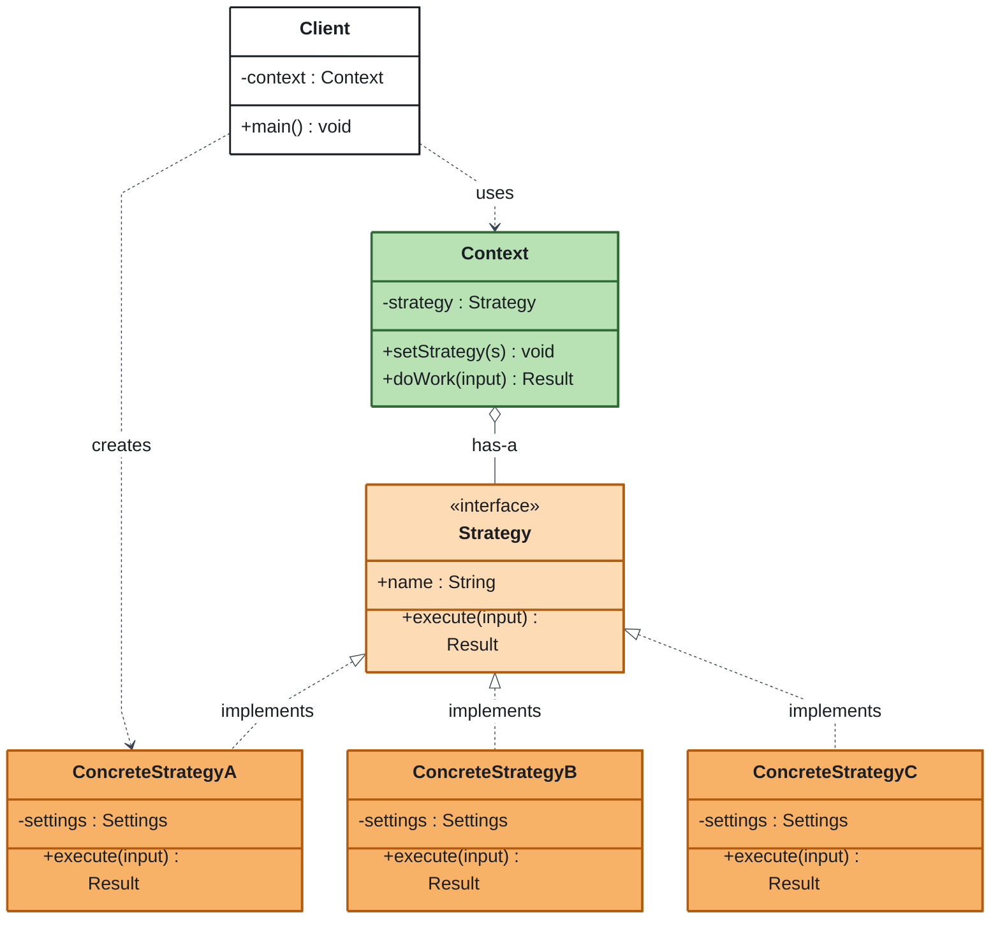

# Strategy Pattern — Head First Design Patterns, Chapter 1

[](https://github.com/enok/design-pattern-strategy/actions/workflows/ci.yml)


-yellow)


Strategy is a behavioral design pattern: it puts a family of interchangeable algorithms behind one interface so the code that needs one can use, and even swap, it at runtime without being edited. This repo is one of a series, `enok/design-pattern-<pattern>`, with one repository per pattern. The study source is *Head First Design Patterns*, 2nd edition, by Eric Freeman and Elisabeth Robson (O'Reilly, 2020). All text and code here are original.

## What's inside

| Step | Content | Where |
| --- | --- | --- |
| 1 | Explanation of the pattern | [`docs/01-pattern-explanation.md`](docs/01-pattern-explanation.md) |
| 2 | Generic diagram | [`docs/02-generic-diagram.md`](docs/02-generic-diagram.md) |
| 3 | Application example | [`docs/03-application-example.md`](docs/03-application-example.md) |
| 4 | Diagram of the example | [`docs/04-example-diagram.md`](docs/04-example-diagram.md) |
| 5-8 | Code by component (all four languages side by side, component by component) | [`docs/05-code-by-component.md`](docs/05-code-by-component.md) |
| 5 | Java 25 code | [`java/`](java/) |
| 6 | Python 3 code | [`python/`](python/) |
| 7 | JavaScript (ECMAScript 2026) code | [`javascript/`](javascript/) |
| 8 | TypeScript 7 code | [`typescript/`](typescript/) |
| 9 | Architecture perspective | [`docs/09-architecture-perspective.md`](docs/09-architecture-perspective.md) |
| 10 | Best YouTube videos per language | [`docs/10-videos.md`](docs/10-videos.md) |

## The pattern at a glance



- **Strategy (light orange):** the common interface for one varying algorithm.
- **ConcreteStrategy (orange):** one implementation of that algorithm; add a rule by adding a class.
- **Context (green):** holds a strategy by composition and delegates to it; the **client (white)** chooses which one it gets.

## The example in one minute

A checkout prices shipping. The flow (take an order, add shipping, return a total) never changes; only the shipping rule does: standard (599 cents, free from 10,000 cents subtotal), express (1,499 + 200 per started kilogram), store pickup (free), or a promotional flat rate of 300. `Checkout` holds a `ShippingStrategy` and can swap it at runtime. Money is integer cents. Every language asserts the same 16 totals (subtotal + shipping, in cents):

| Order | subtotalCents | weightGrams | Standard | Express | Pickup | Flat 300 |
| --- | --- | --- | --- | --- | --- | --- |
| A | 4_990 | 1_200 | 5_589 | 6_889 | 4_990 | 5_290 |
| B | 10_000 | 1_000 | 10_000 | 11_699 | 10_000 | 10_300 |
| C | 9_999 | 0 | 10_598 | 11_498 | 9_999 | 10_299 |
| D | 25_000 | 3_001 | 25_000 | 27_299 | 25_000 | 25_300 |

Demo output (the Python demo labels the last strategy `Flat rate (function)`):

```text
Order: subtotal=49.90 weight=1200g
Standard shipping -> shipping 5.99 | total 55.89
Express shipping -> shipping 18.99 | total 68.89
Store pickup -> shipping 0.00 | total 49.90
Flat rate (lambda) -> shipping 3.00 | total 52.90
Swapped at runtime: Standard shipping -> Express shipping | total 55.89 -> 68.89
```

Details: [`docs/03-application-example.md`](docs/03-application-example.md).

## Run it

Toolchains verified on 2026-10-06: JDK 25.0.4.1 (Temurin) with Maven 3.9.16, Python 3.13 (the code runs on 3.12+, stdlib only), Node 24, TypeScript 7.0.2. Each language has its own README in its folder.

**Java** (`java/`, needs JDK 25 and Maven 3.9.x)

```text
mvn -q verify
java -cp target/classes io.github.enok.patterns.strategy.Demo
```

**Python** (`python/`; the Strategy `Protocol` and `FunctionStrategy` live in `shipping_strategy.py`, the concrete strategies in `strategies.py`)

```bash
cd python
PYTHONPATH=src python -m checkout_strategy
PYTHONPATH=src python -m unittest discover -s tests -t .
```

**JavaScript** (`javascript/`, Node 24)

```bash
cd javascript
npm test        # node --test
npm run demo    # node src/demo.js
```

**TypeScript** (`typescript/`, Node 24+, `typescript@7.0.2`)

```text
npm ci
npm test        # build + node --test over dist/test
npm run demo    # build + print the demo output
npm run typecheck
```

Run each block from inside its own folder.

## Videos

One pick per language (English audio, results pulled 2026-10-06). Backups are in [`docs/10-videos.md`](docs/10-videos.md).

| Language | Title | Channel |
| --- | --- | --- |
| Java | [The Strategy Pattern Explained and Implemented in Java \| Behavioral Design Patterns \| Geekific](https://www.youtube.com/watch?v=Nrwj3gZiuJU) | Geekific |
| Python | [The Strategy Pattern: Write BETTER PYTHON CODE Part 3](https://www.youtube.com/watch?v=WQ8bNdxREHU) | ArjanCodes |
| JavaScript | [Javascript Design Patterns #3 - Strategy Pattern](https://www.youtube.com/watch?v=SicL4fYCz8w) | DevSage |
| TypeScript | [Typescript & Design Patterns \| Strategy Pattern - 1](https://www.youtube.com/watch?v=KGcw4Lq_p5k) | Choice Specs |

## How this repo is maintained

- `main` is protected: no direct pushes.
- Every change lands through a pull request that must pass five CI checks: `java`, `python`, `javascript`, `typescript` and `docs` (link and diagram-drift guard).
- The repo is public and read-only for everyone except the owner.

## References

- Eric Freeman and Elisabeth Robson, *Head First Design Patterns*, 2nd edition, O'Reilly Media, 2020, chapter 1.
- Erich Gamma, Richard Helm, Ralph Johnson and John Vlissides, *Design Patterns: Elements of Reusable Object-Oriented Software*, Addison-Wesley, 1994 (the Strategy entry).
- [ECMA-262, 16th edition](https://262.ecma-international.org/16.0/) and [TC39 finished proposals](https://github.com/tc39/proposals/blob/main/finished-proposals.md) for the JavaScript baseline.

## License

[MIT](LICENSE).
