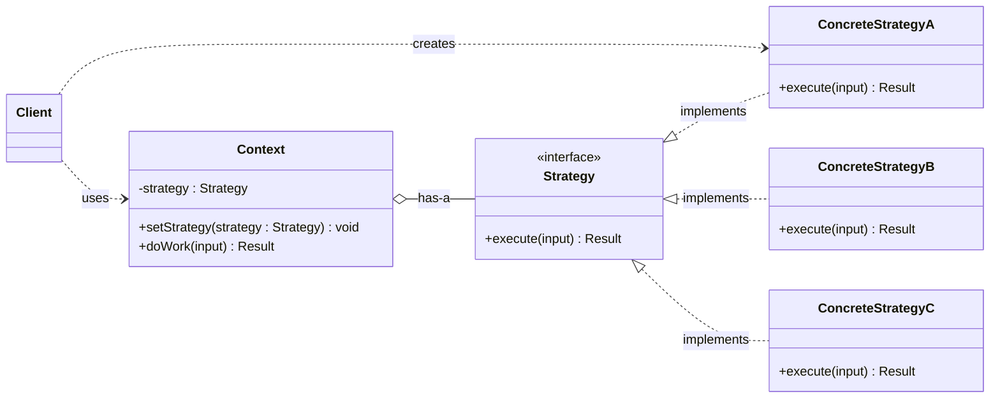
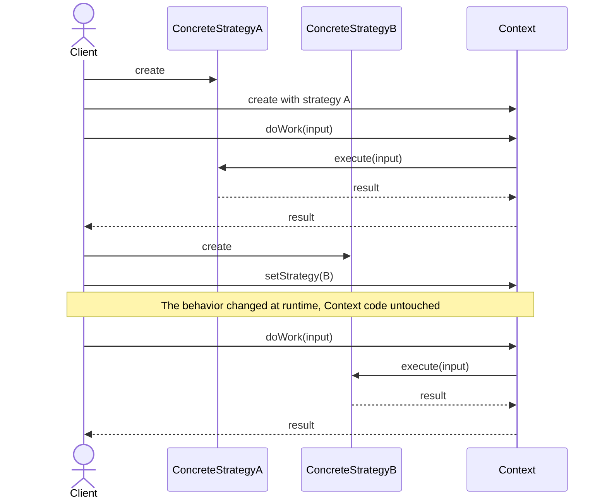

# Strategy pattern: generic diagrams

Back to the explanation: [01-pattern-explanation.md](01-pattern-explanation.md). A concrete application: [03-application-example.md](03-application-example.md).

## Class diagram

Source: [diagrams/strategy-generic-class.mmd](diagrams/strategy-generic-class.mmd)

The `Context` owns a field typed as the `Strategy` interface (the hollow diamond marks the has-a relationship), so it depends on the contract and never on a concrete class. Each `ConcreteStrategy` implements that contract with its own algorithm. The `Client` is the only place that names a concrete strategy: it creates one and gives it to the context, either at construction or through `setStrategy`.

## Sequence diagram

Source: [diagrams/strategy-generic-sequence.mmd](diagrams/strategy-generic-sequence.mmd)

The client builds strategy A and injects it into the context. When the client asks the context to do its work, the context forwards the call to whatever strategy it currently holds. Later the client creates strategy B and swaps it in; the next call to the same context method now runs algorithm B, with no change to the context itself.

## Role table

| Role | Type | Responsibility | Knows about |
| --- | --- | --- | --- |
| Client | Calling code | Chooses a concrete strategy and injects or swaps it | Context, concrete strategies |
| Context | Class | Does its job by delegating the varying step | Only the `Strategy` interface |
| Strategy | Interface | Declares the operation all variants support | Nothing else |
| ConcreteStrategyA / B / C | Classes | Each implements one algorithm behind the interface | Their own inputs and logic |
