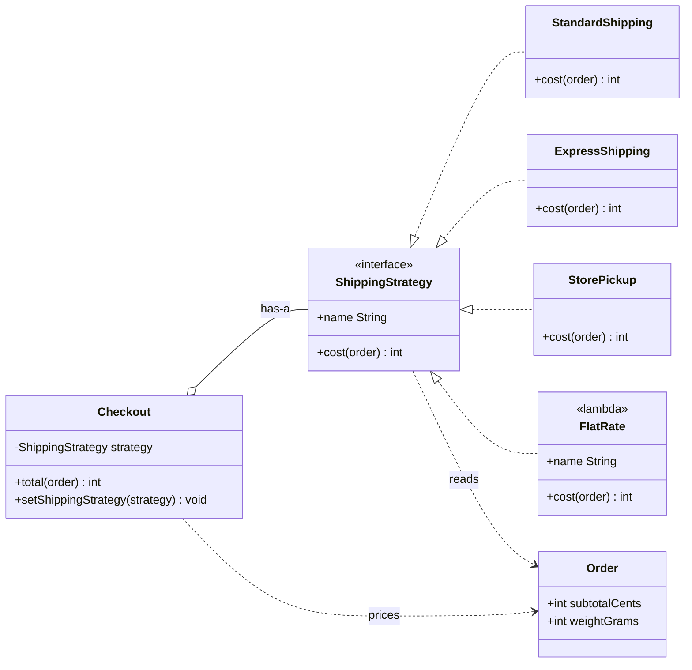
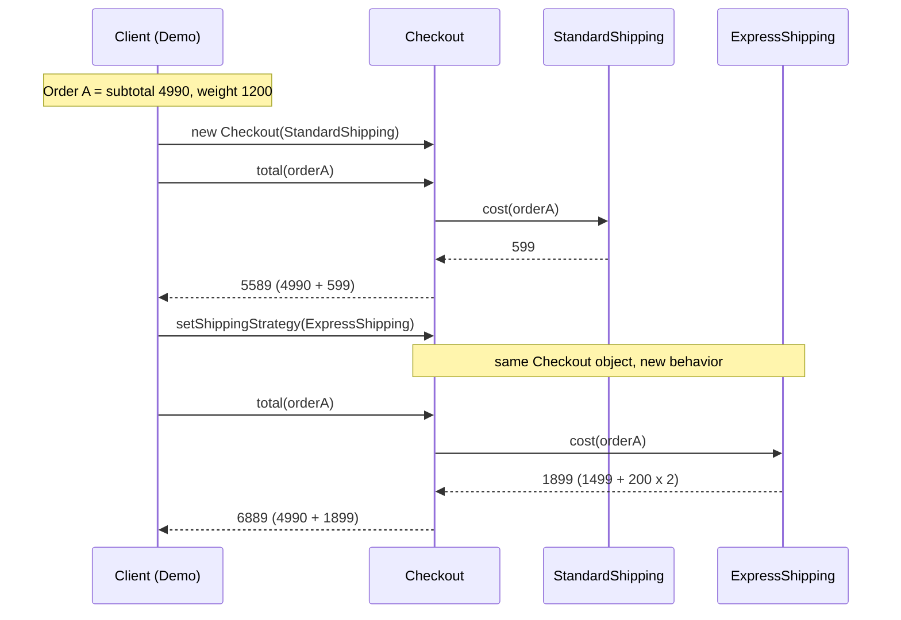

# 04 - Example Diagrams

These diagrams show the checkout shipping slice described in
[03-application-example.md](03-application-example.md). For the generic version of the
pattern, see [02-generic-diagram.md](02-generic-diagram.md).

## Class diagram

Caption: `Checkout` owns one `ShippingStrategy` by composition and never mentions a concrete
class. The three named strategies and the `FlatRate` lambda all satisfy the same one-method
contract, so any of them can be plugged in. Source: [`diagrams/checkout-class.mmd`](diagrams/checkout-class.mmd).

## Sequence diagram

Caption: the demo prices order A with `StandardShipping` (599 cents, total 5,589), swaps the
strategy on the same `Checkout` object, and prices it again with `ExpressShipping`
(1,899 cents, total 6,889). Source: [`diagrams/checkout-sequence.mmd`](diagrams/checkout-sequence.mmd).

## Mapping back to the generic roles

| Generic role (see [02](02-generic-diagram.md)) | In this example |
| --- | --- |
| Strategy | `ShippingStrategy` (`cost(order)`, `name`) |
| ConcreteStrategy | `StandardShipping`, `ExpressShipping`, `StorePickup`, `FlatRate` lambda |
| Context | `Checkout` (`total(order)`, `setShippingStrategy`) |
| Client | The demo, which picks and swaps strategies |
| Data passed to the strategy | `Order` value object |

The theory behind each role is in [01-pattern-explanation.md](01-pattern-explanation.md).
