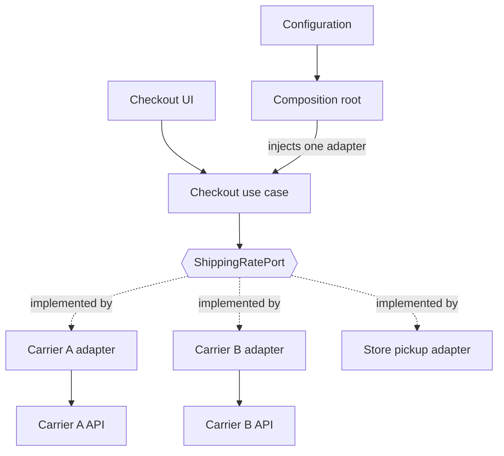
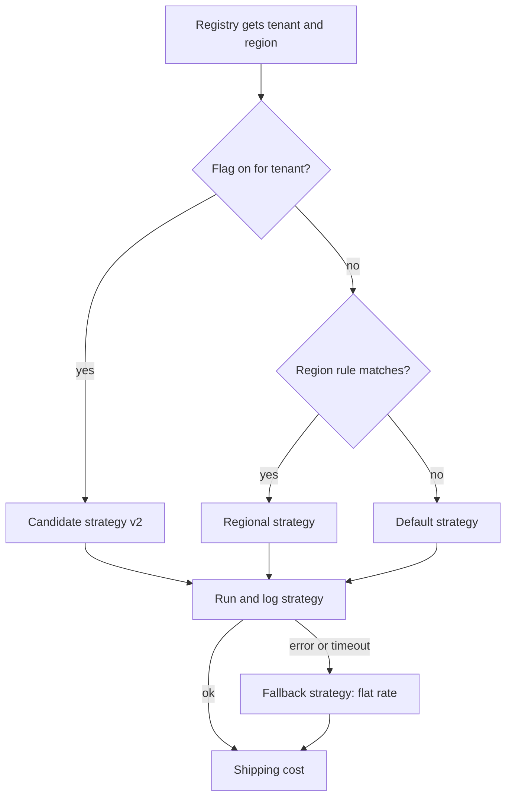
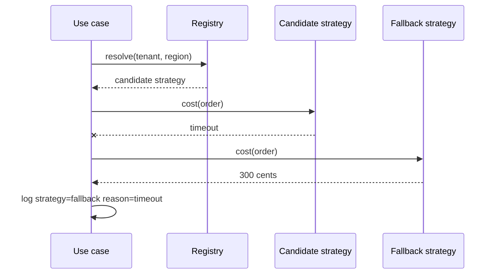
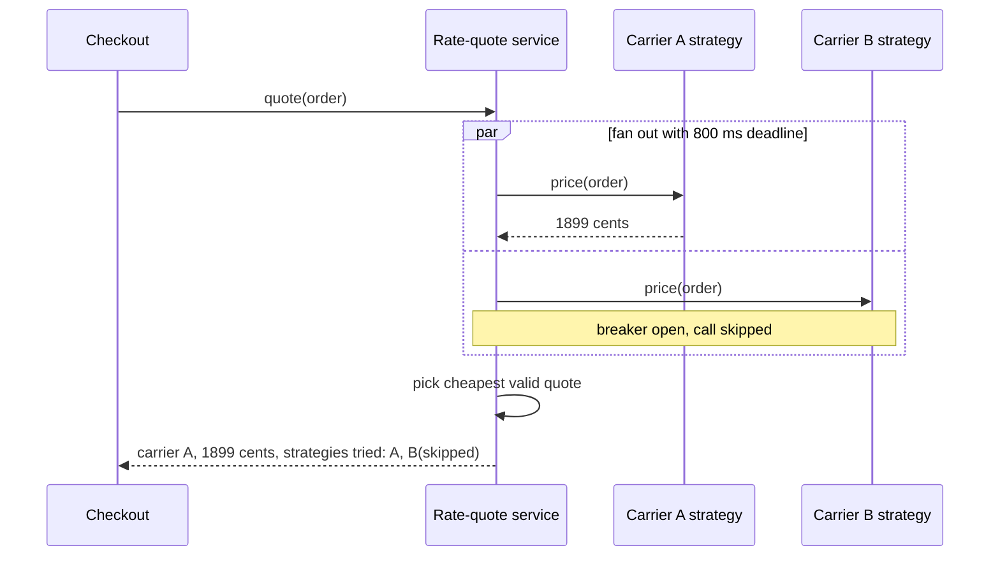
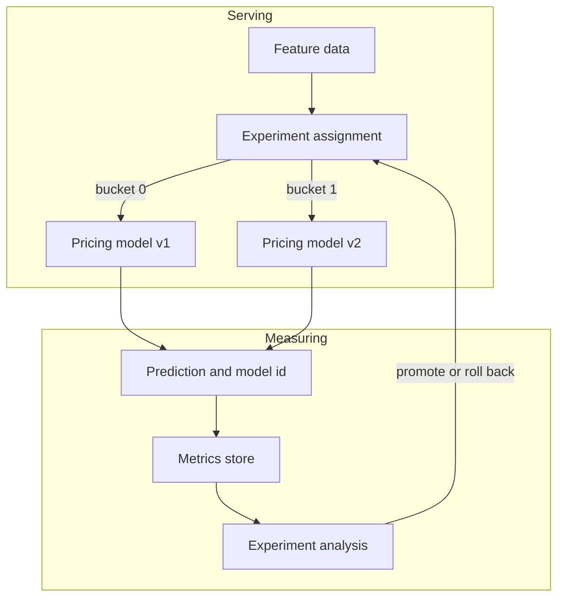

# Strategy at the Architecture Level

The class-level pattern ([01](01-pattern-explanation.md)) swaps an algorithm inside one object. The same idea scales up: a stable core asks a question, and one of several interchangeable answers is chosen elsewhere. This page follows the checkout shipping-cost example ([03](03-application-example.md), [04](04-example-diagram.md)) through four architectural settings. The vocabulary changes (port, adapter, registry, service), but the shape does not: one stable contract, many implementations, a selector outside the caller.

## 1. Strategy behind a port (hexagonal / clean architecture)

In a hexagonal layout the business core defines the interfaces it needs and the outside world supplies implementations. `ShippingStrategy` from the example becomes a `ShippingRatePort`; each carrier gets an adapter that translates the core's `Order` into that carrier's wire format and back. The checkout use case plays the Context and never learns which carrier it is talking to.

*Figure 1. The use case depends only on the port; the composition root injects the adapter chosen by configuration.*

**Forces**
- Carrier APIs change on their own schedule, and the core should not recompile or retest when they do.
- Switching or adding a carrier should be a configuration and wiring change.

**Trade-offs**
- Gain: the dependency arrow points inward, adapters are replaceable, and an in-memory fake adapter makes tests trivial.
- Cost: one more interface and mapping layer per integration. If you only ever have one carrier and no tests that need a fake, the port is ceremony.
- Keep the port in domain language (`quote(order) -> Money`), not in carrier terms; otherwise the abstraction leaks and every adapter fights it.

## 2. Runtime selection by policy

Choosing the strategy at startup is the simplest case. Real systems often choose per request: per tenant, per region, or per experiment. A strategy registry maps stable keys to implementations; the DI container fills it, and a small policy layer decides which key applies.

*Figure 2. Selection order: feature flag first, then region rule, then the default. Any failure drops to a fallback.*

**Forces**
- Different tenants or regions legitimately need different rules (taxes, carriers, free-shipping thresholds).
- A new strategy must reach production gradually, and be reversible without a deploy.
- A selection bug should degrade service, not stop checkout.

**Safe rollout and fallback.** Ship the new strategy dark, enable it for an internal tenant, then widen the percentage. Always register a boring fallback (here, flat rate) that cannot fail because it makes no remote calls.

*Figure 3. A candidate that times out is replaced by the fallback, and the reason is recorded.*

**Trade-offs**
- Gain: behavior changes without redeploying the Context; experiments and tenant rules become data.
- Cost: the selection policy is now a second system to test. The number of reachable (tenant, flag, region) combinations grows quickly, and stale flags become dead strategies nobody dares delete.

## 3. Strategy across service boundaries

When rate calculation needs live carrier data, the strategies may sit behind a dedicated rate-quote service. Each carrier strategy calls its upstream, the service fans out in parallel with a deadline, drops failed or slow answers, and returns the cheapest valid quote.

*Figure 4. Fan-out with a shared deadline; the open breaker for Carrier B skips the call instead of waiting.*

**Forces**
- Quotes depend on remote systems with uneven latency and availability.
- Checkout has a hard response budget; one slow carrier must not consume it.
- Callers want a single answer plus an explanation of how it was reached.

**Design points**
- Give every strategy call its own timeout inside an overall deadline, and run a circuit breaker per carrier so repeated failures stop costing latency.
- Treat "no quote" as a normal result. If every strategy fails, fall back to a published flat rate rather than error out.
- Return which strategies ran, were skipped, or failed; this is your debugging trail.

**When this is over-engineering.** A network hop turns a method call into a distributed system: partial failure, versioned contracts, deployment coupling, and an on-call rotation. Keep the strategies in-process (section 1) unless at least one of these holds: strategies are owned by different teams, they must scale or deploy independently, or the data they need cannot live in the main application.

## 4. Pluggable algorithms in data and ML pipelines

Pricing, ranking, and recommendation pipelines apply the pattern naturally: the pipeline stage is the Context, and each model version is a strategy behind a common `predict(features)` contract. An experiment framework assigns each request or user to a bucket, which picks the strategy, and the chosen model id is stored with the outcome.

*Figure 5. Assignment picks the model; the logged model id lets analysis attribute results to a strategy.*

**Forces**
- Models are retrained often, and live traffic is the honest test; rollback must be a bucket flip.

**Trade-offs**
- Gain: safe comparison and quick rollback.
- Cost: the contract must pin down input features, output units, and latency limits, or "interchangeable" models turn out not to be. Assignment must be sticky per user, or measurements are polluted. Feature drift can affect one strategy but not the other, so monitor per strategy, not just overall.

## Strategy vs plugin architecture vs rules engine

| Aspect | Strategy | Plugin architecture | Rules engine |
| --- | --- | --- | --- |
| Question it answers | Which algorithm computes this? | Which extra capabilities load? | Which outcome do these conditions imply? |
| Extension point | One narrow interface | Many hooks, often discovered at runtime | Declarative rules evaluated by an engine |
| Who authors variants | Developers | Often third parties | Often analysts or operators |
| Lifecycle | Compiled in or wired in | Loaded, versioned, isolated | Edited as data, hot-reloaded |

They combine well: a plugin system can contribute strategies, and a rules engine can act as the selector from section 2. A rules engine becomes the right choice when the variation is mostly conditions and thresholds that non-developers must edit; Strategy is the right choice when the variation is genuinely different procedures.

## Operational concerns

- **Observability.** Log the strategy name, its version, the selection reason (flag, region, fallback), and duration on every call. Emit metrics tagged by strategy. Without this, "which rule produced this price?" is unanswerable.
- **Contract tests.** Write one suite against the port that every strategy, including fakes and the fallback, must pass: non-negative integer cents, determinism for equal input, documented behavior for zero weight, bounded latency. Add a new strategy by adding it to the suite's list. The golden table from the example is a small instance of this idea.
- **Versioning.** Treat the port as a public API. Add optional fields rather than changing meaning; run old and new strategy versions side by side during migration; retire a version only after its traffic reaches zero in the logs.

## Checklist: is architectural Strategy worth it?

- [ ] At least two real variants exist today, or one is contractually planned.
- [ ] The variants change for different reasons or at different speeds than the caller.
- [ ] The choice must be made at runtime, by tenant, region, flag, or experiment.
- [ ] You can state the contract in domain terms, with tests every variant can pass.
- [ ] You will log which variant ran, and you have a safe fallback.
- [ ] For a network boundary: independent ownership or scaling is needed, and the latency budget has room for timeouts.
- [ ] A plain conditional or a configuration value would not do the job just as well.

If most boxes stay unchecked, keep the simple code from the example and revisit when the variation shows up.
